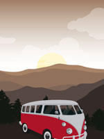
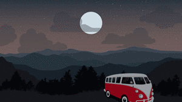

# Red Van Workshop Wallpapers

> If you're a big fan of the Red Van, we made these especially for you.

Desktop
---

Mobile
---

Mac OS Dynamic Desktop
---

If you are using MacOS Mojave, you can add Dynamic Desktops that change based on time of day.  The `rvw-light-dark` files will switch between a day and night theme.  The `rvw-solar` files will change automagically based on time of day, and switch between the 10 different daylight options.

